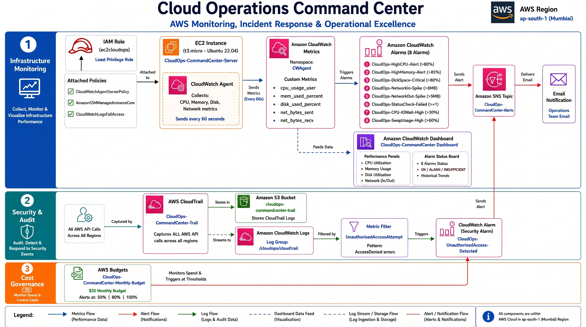
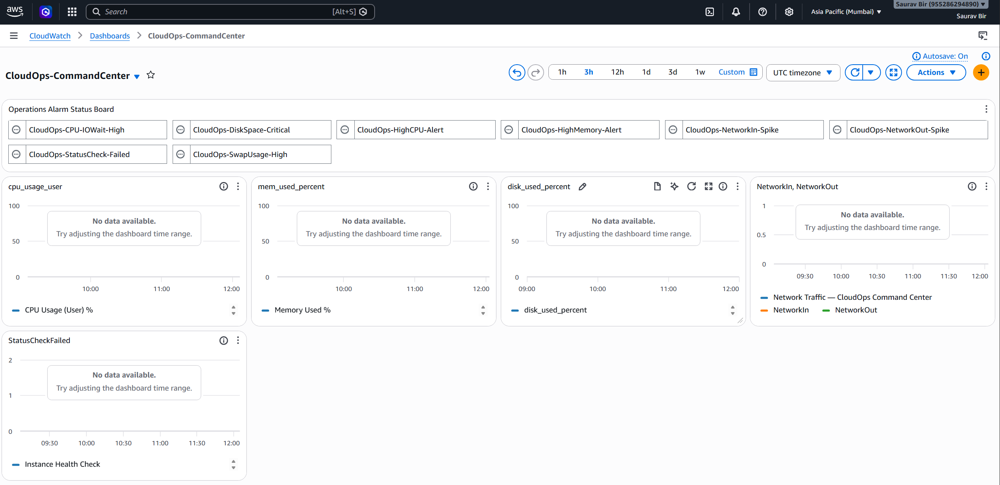
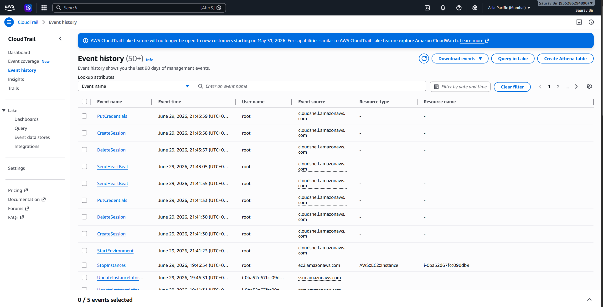
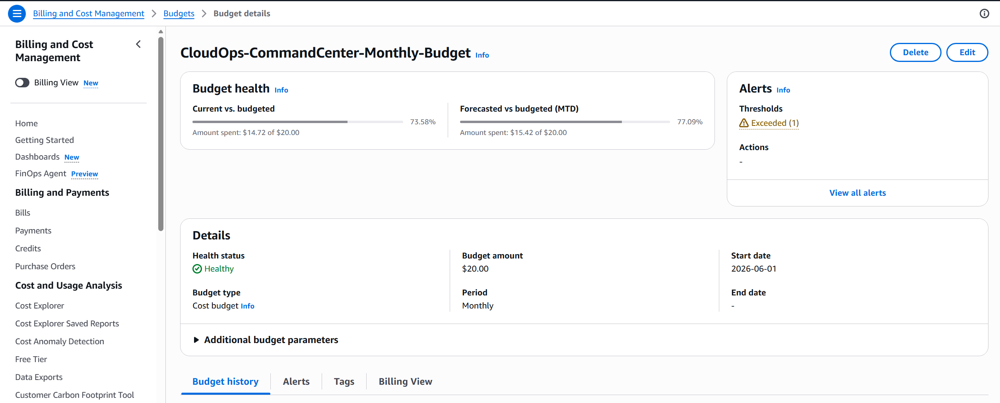
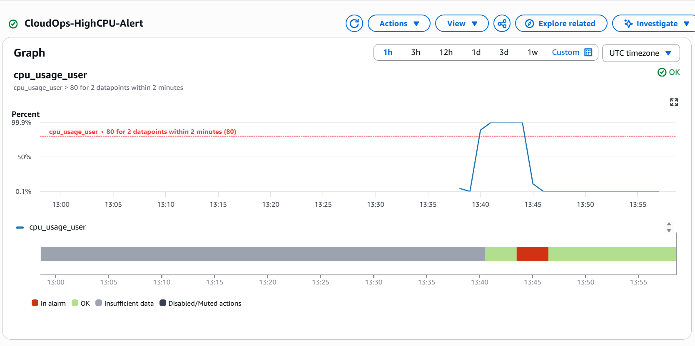

# Cloud Operations Command Center
### AWS Monitoring, Incident Response & Operational Excellence

---

## Problem Statement

Production infrastructure fails silently. Without proactive 
monitoring, teams discover outages only after users complain — 
averaging 2-4 hours of undetected downtime. This project builds 
a complete cloud operations command center that detects, alerts, 
and documents infrastructure failures automatically.

---

## What This Project Does

A fully operational AWS monitoring platform that:
- Watches 8 critical infrastructure metrics 24/7
- Fires automated alerts via email within 2 minutes 
  of threshold breach
- Provides single-pane-of-glass visibility across 
  all infrastructure
- Audits every AWS API call for security compliance
- Governs cloud costs with multi-threshold budget alerts
- Documents 4 real incident simulations with full RCA reports

---

## Architecture

---

## AWS Services Used

| Service | Purpose |
|---|---|
| EC2 (t3.micro) | Ubuntu server — monitoring target |
| CloudWatch Agent | Custom metrics: CPU, Memory, Disk, Network |
| CloudWatch Alarms | 8 automated threshold breach detectors |
| CloudWatch Dashboard | Single-pane operations visibility |
| CloudWatch Logs | Centralised log aggregation |
| SNS | Alert notification delivery |
| CloudTrail | Full AWS API audit logging |
| IAM | Least-privilege role-based access |
| AWS Budgets | Cost governance + overspend alerts |

---

## Monitoring Coverage

### 8 CloudWatch Alarms Configured

| Alarm | Metric | Threshold | Action |
|---|---|---|---|
| High CPU | cpu_usage_user | > 80% | SNS Email |
| High Memory | mem_used_percent | > 85% | SNS Email |
| Disk Critical | disk_used_percent | > 80% | SNS Email |
| Network In Spike | NetworkIn | > 5MB/min | SNS Email |
| Network Out Spike | NetworkOut | > 5MB/min | SNS Email |
| Status Check Failed | StatusCheckFailed | >= 1 | SNS Email |
| CPU IOWait High | cpu_usage_iowait | > 20% | SNS Email |
| Swap Usage High | swap_used_percent | > 50% | SNS Email |

---

## Incident Simulations & RCA Documentation

4 production failure scenarios simulated and documented:

| Incident | Severity | Detection Time | Status |
|---|---|---|---|
| [INC-001 CPU Spike](Docs/INCIDENT_REPORT___CPU_Spike.md) | P2 | < 2 min | Resolved |
| [INC-002 Disk Exhaustion](docs/INC-002.md) | P1 | < 3 min | Resolved |
| [INC-003 Unauthorised Access](Docs/INCIDENT_REPORT___Unauthorised-Access.md) | P1 | < 5 min | Resolved |
| [INC-004 Budget Breach](Docs/INCIDENT_REPORT___Budget-Breach.md) | P2 | < 10 min | Resolved |

---

## Dashboard

---

## Key Screenshots

| Component | Evidence |
|---|---|
| All 8 Alarms Active |  |
| CloudTrail Active |  |
| Budget Configured |  |
| CPU Spike Detected |  |

---

## Security Implementation

- IAM Role with least-privilege policies 
  (no root credentials)
- CloudTrail enabled across all regions
- Automated AccessDenied detection via 
  CloudWatch metric filter
- SNS security alerts with sub-5-minute 
  detection time

---

## Cost Governance

- AWS Budget: $20/month ceiling
- Alerts at 50% ($10), 80% ($16), 100% ($20)
- Actual project cost: $0-3/month on AWS Free Tier

---

## Author

**Saurav Bir** — Cloud Operations Engineer  
[GitHub](https://github.com/Sbir93)

---

*Built to demonstrate production-grade CloudOps 
monitoring, incident response, and operational 
excellence on AWS Free Tier.*
